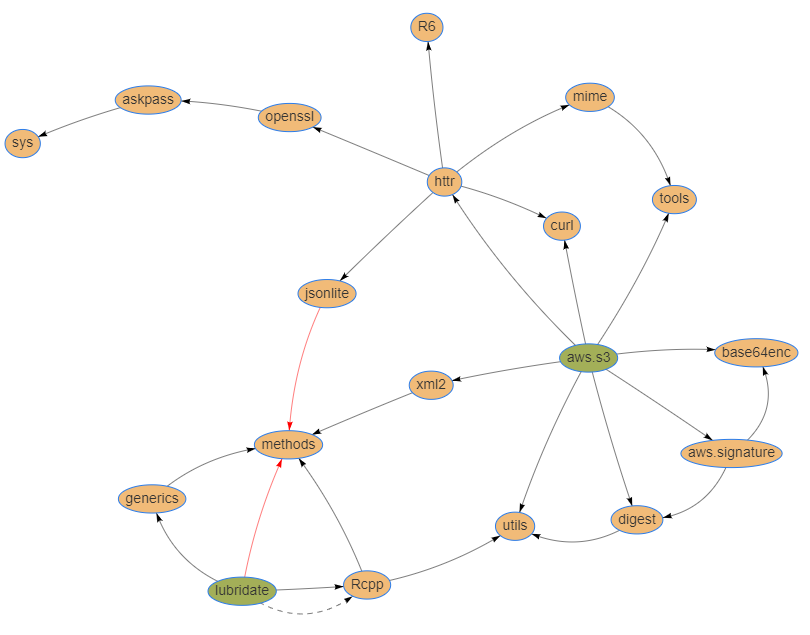

# CRAN Dependency Visualizer
> Create interactive R package dependency graphs in the browser

[][1]
[Try it out!][1]

# Similar Projects
* `pkggraph` - https://talegari.github.io/pkggraph/
* `pkgDepTools` - https://rdrr.io/bioc/pkgDepTools
* `miniCRAN` - http://andrie.github.io/miniCRAN/

# Author
Tanner Nielsen <tannerntannern@gmail.com>
* Website - [tannernielsen.com](http://tannernielsen.com)
* Github - [tannerntannern](https://github.com/tannerntannern)

[1]: https://tannerntannern.github.io/cran-visualizer/#/packages/imports,depends,linkingTo/aws.s3,lubridate
